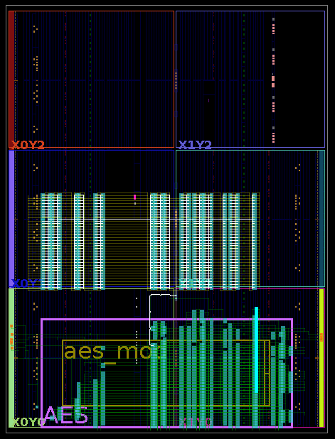
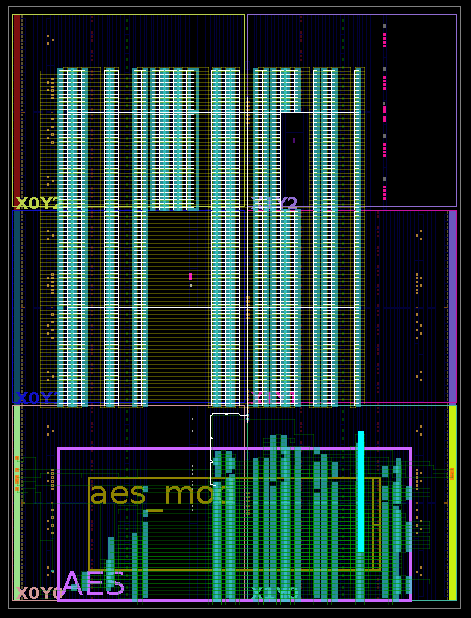

## Comparison of Different Samples of FPGAs Utilizing SC Array and a Glitch Detector with Adjustable Calibration Line

### Main Components of the setup

#### Target Board

In the given setup, the socketed `NAE-CW305-04-SOCKET-0.10-X` version of NewAE Technology's CW305 FPGA board was used.

#### FPGA Instances

In the series of experiments, `XC7A35T-1FTG256C AMD FPGA - Field Programmable Gate Array` samples were tested and calibrated, mapping 
Glitch Detector with Adjustable Calibration line from `firmware/hdl/Voltage_Glitch_Detectors/Detector_1`.

#### Glitch Detector

The main components of the given sensor include a **delay line** consisting of **Carry 4 delay elements** (Artix-7), a **Mixed-Mode Clock Manager (MMCM)** module from **Xilinx Vivado**, and a **control block**.

### Working Process Flow

The working process flow of the series of experiments, utilizing SC calibration, is as follows:

1. **Generating checkpoints:** `.dcp` files using Xilinx Vivado and integrating the Glitch Detector with Adjustable Calibration.
2. **Mapping SC arrays:** on the corresponding checkpoint file, ranging from **0, 55, 50, 83** to **0, 55, 50, 135** coordinates for the possibility of adjusting the strength of the Voltage Glitch.
3. **Glitching the Target AES Module:** Applying glitches of varying strength to the AES module and determining the required number of short-circuits (SCs) to successfully glitch the AES module for each FPGA instance.
4. **Calibration Delay Line Measurement:** Using the calibration delay line to determine the Hamming weight value of the sensor corresponding to the predefined number of SCs required for a successful optimal AES glitch for each FPGA instance.
5. **Presetting the Calibration Logic:** The predefined Hamming weight value is then set in the calibration logic of the control block, ensuring safe margins for each FPGA instance.

By utilizing this workflow system, we can define voltage glitch values and successfully implement the detector independently of current noise voltage levels and environmental conditions, identifying differences in optimal glitches depending on manufacturing variations of FPGA instances.

### Conducted Experiments

The layout of the sensor, AES module, and edge cases of SC arrays with **0, 55, 50, 83** and **0, 55, 50, 135** coordinates are shown in [**Fig. 1**](#fig1) and [**Fig. 2**](#fig2). The thorough map of experiments is provided in `/Voltage_Glitch_Detectors/10_FPGAs_Calibration/10_FPGAs_Internal_Calibration_Map.xlsx`.

#### Fig. 1, 2
## <a name="fig1"></a>  <a name="fig2"></a>
<div style="display: flex; justify-content: space-around;">
  
  
</div>


We conducted a series of tests with different numbers of SCs to determine the minimum number required to successfully glitch the AES module on 10 FPGA samples. This allowed us to identify the minimum actual voltage level capable of glitching the AES module and calibrate the sensor on each FPGA instance.

Next, we determined the Hamming weight values of the detector for the given voltage glitch strength. 

In our setup, we tested FPGAs in the range of **0, 55, 50, 83** to **0, 55, 50, 135** coordinates of SCs to find a successful and optimal AES glitch for each instance:

```
FPGA CW305(socket, #1)  Optimal Voltage Glitch with coordinates: 0, 55, 50, 132; Hamming Weight: 9
FPGA CW305(socket, #2)  Optimal Voltage Glitch with coordinates: 0, 55, 50, 125; Hamming Weight: 7
FPGA CW305(socket, #3)  Optimal Voltage Glitch with coordinates: 0, 55, 50, 125; Hamming Weight: 7
FPGA CW305(socket, #4)  Optimal Voltage Glitch with coordinates: 0, 55, 50, 135; Hamming Weight: 8
FPGA CW305(socket, #5)  Optimal Voltage Glitch with coordinates: 0, 55, 50, 132; Hamming Weight: 7
FPGA CW305(socket, #6)  Optimal Voltage Glitch with coordinates: 0, 55, 50, 118; Hamming Weight: 7
FPGA CW305(socket, #7)  Optimal Voltage Glitch with coordinates: 0, 55, 50, 127; Hamming Weight: 7
FPGA CW305(socket, #8)  Optimal Voltage Glitch with coordinates: 0, 55, 50, 129; Hamming Weight: 7
FPGA CW305(socket, #9)  Optimal Voltage Glitch with coordinates: 0, 55, 50, 133; Hamming Weight: 7
FPGA CW305(socket, #10) Optimal Voltage Glitch with coordinates: 0, 55, 50, 125; Hamming Weight: 7
```

### Detection Metrics

After conducting the experiments, we identified that the minimum optimal number of SCs for a **100% successful AES glitch** in the no-socket CW305 version was **0, 55, 50, 83**, whereas on the socket board FPGA CW305 (socket, #6) instance, it was **0, 55, 50, 118**. The maximum number of SCs to successfully glitch AES in the given setup was determined as **0, 55, 50, 135** for FPGA CW305 (socket, #4). We used these voltage levels while calculating the detection metrics of the sensor.

Additionally, we determined that the **minimum sensitivity** of the sensor corresponds to the range from **7 Hamming weight** to **9 Hamming weight** at the corresponding optimal glitch levels. 
At these points, the following metrics: **Detection Rate**, **Precision**, **Specificity**, and **Accuracy** achieved **100%**.

To ensure robustness against **manufacturing variations, noise levels, and environmental dependencies**, we increased the sensor's sensitivity by **5 Hamming weight values**, minimizing the risk of **false negatives**.


### Hamming Weight Values per FPGA Instance:

- **FPGA CW305 (socket, #1)  :**  **9 + 5 = 14** ✨
- **FPGA CW305 (socket, #2)  :**  **7 + 5 = 12** ✨
- **FPGA CW305 (socket, #3)  :**  **7 + 5 = 12** ✨
- **FPGA CW305 (socket, #4)  :**  **8 + 5 = 13** ✨
- **FPGA CW305 (socket, #5)  :**  **9 + 5 = 14** ✨
- **FPGA CW305 (socket, #6)  :**  **7 + 5 = 12** ✨
- **FPGA CW305 (socket, #7)  :**  **7 + 5 = 12** ✨
- **FPGA CW305 (socket, #8)  :**  **7 + 5 = 12** ✨
- **FPGA CW305 (socket, #9)  :**  **7 + 5 = 12** ✨
- **FPGA CW305 (socket, #10) :**  **7 + 5 = 12** ✨

