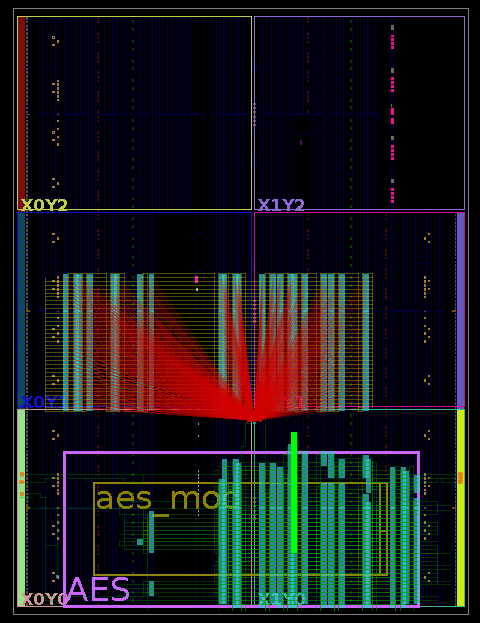

## Glitch Detector with Adjustable Calibration 

### Main Components

The main components of the given sensor, as shown in [**Fig. 1**](#fig1), include a **delay line** consisting of **Carry 4 delay elements** (Artix-7), a **Mixed-Mode Clock Manager (MMCM)** module from **Xilinx Vivado**, and a **control block**.

#### Fig. 1
## 

### Featured Characteristics

The detector was implemented due to the features of the sensor, particularly its sensor delay line, allowing it to determine the Hamming weight value of the glitch that successfully attacks the target module. This enables us to define the strength of the glitch and extract calibration margins, ensuring successful deployment of the sensor on any FPGA board, and regardless of voltage noise levels.

### Working Process Flow - Internal Calibration

The working process flow of the sensor, utilizing SC calibration, is as follows:

1. **Glitching the Target AES Module:** We first apply glitches to the AES module and determine the required number of short-circuits (SCs) to successfully glitch the AES module.
2. **Calibration Delay Line Measurement:** Using the calibration delay line, we determine the Hamming weight value of the sensor, corresponding to the predefined number of SCs required for a successful AES glitch.
3. **Presetting the Calibration Logic:** The predefined Hamming weight value is then set in the calibration logic of the control block, ensuring safe margins.

By utilizing this detection system, we can define voltage glitch values and successfully implement the detector independently of current noise voltage levels and environmental conditions.

### Conducted Experiments - Internal Calibration

The layout of the sensor and AES module is shown in [**Fig. 2**](#fig2), and the layout of the setup with the SC array is depicted in [**Fig. 3**](#fig2). The thorough map of experiments is provided in `/Voltage_Glitch_Detectors/Test_Calibration_Map.xlsx`.

#### Fig. 2, 3
## 

  
  

## 

First of all, we conducted a series of tests with different numbers of SCs to determine the minimum number required to successfully glitch the AES module. This allowed us to identify the minimum actual voltage level capable of glitching the AES module. 

Next, we determined the Hamming weight values of the detector for the given voltage glitch strength. In our setup, the required SCs for a successful AES glitch were **0, 55, 50, 83**, and the corresponding Hamming weight value was **7**.

To minimize the risk of **false negatives**, we introduced a **safety margin** in the phase shift.

### Detection Metrics - Internal Calibration

After conducting the experiments, we identified that the minimum number of SCs for a **100% successful AES glitch** were **0, 55, 50, 83**. We used this voltage level while calculating the detection metrics of the sensor. 

Additionally, we determined that the **minimum sensitivity** of the sensor corresponds to **7 Hamming weight** at this voltage glitch level. At this point, the following metrics: **Detection Rate**, **Precision**, **Specificity** and **Accuracy** achieved **100%**.

To ensure robustness against **manufacturing variations, noise levels, and environmental dependencies**, we increased the sensor's sensitivity by **5 Hamming weight values**, minimizing the risk of **false negatives**.

Thus, for the given setup, we set an alarm threshold at:

**7 + 5 = 12** - **✨ Hamming Weight Values**

### Working Process Flow - External Calibration

The working process flow of the sensor with calibration, utilizing the ChipWhisperer-Husky, is as follows:

1. **Glitching the Target AES Module:** We first apply glitches to the AES module using the ChipWhisperer-Husky setup and determine the required voltage glitch to successfully glitch the AES module, varying the duration of the glitch and the internal voltage level of the FPGA setup.
2. **Calibration Delay Line Measurement:** Using the calibration delay line, we determine the Hamming weight value of the sensor corresponding to each setup.
3. **Presetting the Calibration Logic:** The predefined Hamming weight value is then set in the calibration logic of the control block, ensuring safe margins.

By utilizing this detection system, we can define voltage glitch values and successfully implement the detector independently of current noise voltage levels and environmental conditions.

### Conducted Experiments - External Calibration

The layout of the sensor and AES module is shown in [**Fig. 4**](#fig4). The thorough map of experiments is provided in `/Voltage_Glitch_Detectors/External_Test_Calibration_Map.xlsx`

We conducted a series of tests with different voltage levels of the FPGA and different durations of the glitch required to successfully glitch the AES module.

#### Fig. 4
## 

  

In our setup, we determined that for a voltage level of 0.7 volts, glitches with durations of 3 and 2 cycles were successful, with a maximum corresponding Hamming weight value of 16, whereas a glitch with a duration of 1 cycle was not successful, with a corresponding Hamming weight value of 66.

To minimize the risk of **false negatives**, we introduced a **safety margin** in the phase shift.

### Detection Metrics - External Calibration

After conducting the experiments, we identified that in the given setup, a **100% successful AES glitch** depended on two parameters: the voltage level of the FPGA and the duration of the glitch. Thus, the maximum voltage level of the FPGA where a voltage glitch was successful was identified at 0.9 volts, with a 3-cycle duration of the glitch. The minimum voltage level of the FPGA where a voltage glitch was successful was identified at 0.7 volts, with a 2-cycle duration of the glitch.

Additionally, we determined that the **minimum sensitivity** of the sensor corresponds to:
- **47 Hamming weight** at 0.9 volts of the FPGA.
- **30 Hamming weight** at 0.8 volts of the FPGA.
- **16 Hamming weight** at 0.7 volts of the FPGA.

At these points, the following metrics: **Detection Rate**, **Precision**, **Specificity**, and **Accuracy** achieved **100%**.

Since the strength of the glitch capable of successfully glitching AES may fluctuate due to different mappings and manufacturing features, we maintain safe margins.
To ensure robustness against **manufacturing variations, noise levels, and environmental dependencies**, we increased the sensor's sensitivity by **5 Hamming weight values**, minimizing the risk of **false negatives**.

In our setup, we determined that for a voltage level of 0.7 volts, glitches with durations of 3 and 2 cycles were successful, with a corresponding **Hamming weight value of 16**.

Thus, for the given setup, for 0.7 V we set an alarm threshold at:

**16 + 5 = 21** - **✨ Hamming Weight Values**

Subsequently, in our setup, we determined that for a voltage level of 0.8 volts, only a glitch duration of 3 clock cycles was successful, with a corresponding **Hamming weight value of 30**.

Thus, for the given setup, for 0.8 V we set an alarm threshold at:

**30 + 5 = 35** - **✨ Hamming Weight Values**

Subsequently, in our setup, we determined that for a voltage level of 0.9 volts, only a glitch duration of 3 clock cycles was successful, with a corresponding **Hamming weight value of 47**.

Thus, for the given setup, for 0.9 V we set an alarm threshold at:

**47 + 5 = 52** - **✨ Hamming Weight Values**

### Calibration Potential of the Sensor 

The calibration approach, based on the integrated delay line of the given detector, allows monitoring of voltage glitch strength. This capability enables the sensor to be deployed in **any environment, on any FPGA board, and under any voltage noise level**, independent of manufacturing variations.

### Per-Unit Testing Evaluation

The potential for **per-unit testing** is promising for the given setup, as all steps in the **Working Process Flow** can be potentially automated. This enables a streamlined and efficient verification process for each chip.
