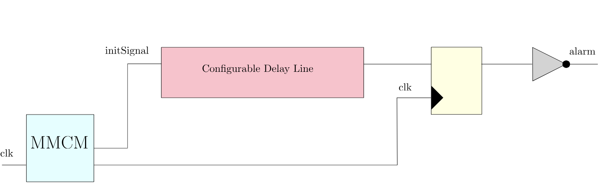
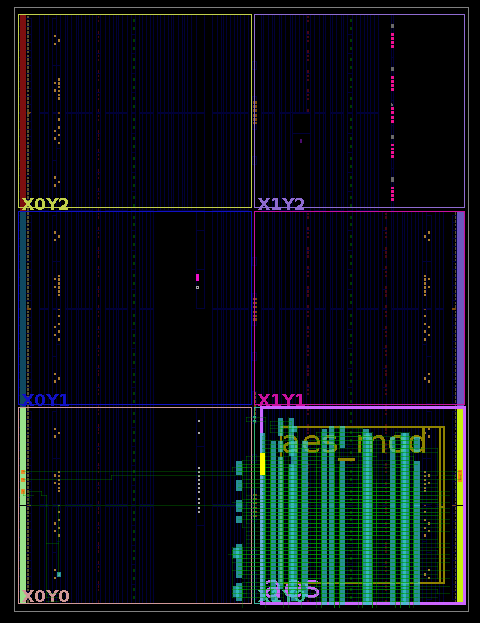
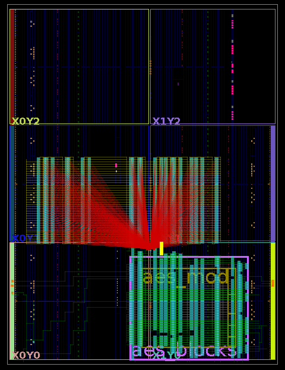
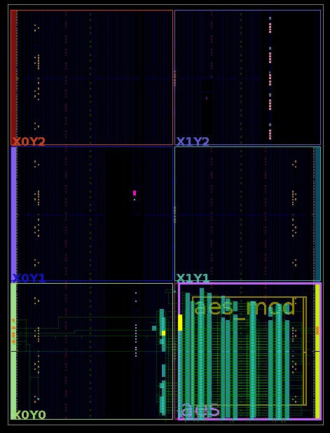

## Phase Adjustable Glitch Detector with Configurable Delay Line  

### Main Components

The main components of the given sensor, as shown in [**Fig. 1**](#fig1), include a **configurable delay line** consisting of **Carry 4 delay elements** (Artix-7), a **Mixed-Mode Clock Manager (MMCM)** module from **Xilinx Vivado**, and an **alarm module**.

#### Fig. 1
## 

### Featured Characteristics  

The detector was implemented due to the features of the sensor, particularly its its ability to **fine-tune** during the calibration phase, utilizing two parameters. It leverages the **phase shift** capability of the MMCM and features a **configurable delay line**, enabling precise calibration by adjusting:

1. **The phase shift of the propagation signal**
2. **The delay of the sensor**

By tuning these two parameters, the detector achieves highly accurate calibration.
 

### Working Process Flow - Internal Calibration

The working process flow of the sensor, utilizing SC calibration, is as follows:

1. **Determining the Required SCs:** We first identify the minimum number of **short-circuits (SCs)** needed for a successful glitch.

2. **Calibrating the Sensor:** We adjust the **phase shift** between the signal propagating through the delay line and the clock signal driving the register at the end of the delay block.

3. **Validating the Delay Line Configuration:** We verify whether the sensor's delay configuration is appropriate for the given setup. (Allow for further calibration if necessary)

By leveraging these tuning mechanisms, the detector achieves precise calibration, independently controlling **phase shift** and **sensor delay**.

### Conducted Experiments - Internal Calibration

The layout of the sensor and AES module is shown in [**Fig. 2**](#fig2), and the layout of the setup with the SC array is depicted in [**Fig. 3**](#fig2). The thorough map of experiments is provided in `/Voltage_Glitch_Detectors/Test_Calibration_Map.xlsx`.

We conducted a series of experiments to test the detector's sensitivity and performance, using SC arrays:

#### Fig. 2, 3
## 

  
  

## 

First, we tested the number of **short-circuits (SCs)** required to successfully glitch the AES module with the given setup. During these tests, we also varied the **phase shift** of the delay signal to adjust the sensitivity.

We identified the point at which we achieved 100% true positives, with **100% successful glitches**, using the minimum number of SCs, and **100% detection rate**.

Thus, we determined the minimum voltage level for a successful glitch and the **border level of sensitivity** at which this voltage glitch is successfully detected. We achieved **100% true positives** at the **0, 55, 50, 83 SC array** and a **-74° phase shift**.

To minimize the risk of **false negatives**, we introduced a **safety margin** in the phase shift.

 
### Detection Metrics - Internal Calibration

After conducting extensive tests, we determined:  

- The minimum SCs required for a **100% successful AES glitch**: **0, 55, 50, 83 SC array**  
- The minimum sensitivity threshold: **74° phase shift**  

At this point, in the given conditions the detector achieved **100%** in all detection metrics: **Detection Rate**, **Precision**, **Specificity**, and **Accuracy**.

To ensure robustness against **manufacturing variations, noise, and environmental factors**, we introduced a **5° safety margin**:

**-74° + 5° = -69°** - **✨ Phase Shift degrees**   

### Working Process Flow - External Calibration

The working process flow of the sensor with calibration, utilizing the ChipWhisperer-Husky, is as follows:

1. **Glitching the Target AES Module:** We first apply glitches to the AES module using the ChipWhisperer-Husky setup and determine the required voltage glitch to successfully glitch the AES module, varying the duration of the glitch and the internal voltage level of the FPGA setup.

2. **Calibrating the Sensor:** We adjust the **phase shift** between the signal propagating through the delay line and the clock signal driving the register at the end of the delay block.

3. **Validating the Delay Line Configuration:** We verify whether the sensor's delay configuration is appropriate for the given setup. (Allow for further calibration if necessary)

By leveraging these tuning mechanisms, the detector achieves precise calibration, independently controlling **phase shift** and **sensor delay**.

### Conducted Experiments - External Calibration

The layout of the sensor and AES module is shown in [**Fig. 4**](#fig4). The thorough map of experiments is provided in `/Voltage_Glitch_Detectors/External_Test_Calibration_Map.xlsx`

We conducted a series of tests with different FPGA voltage levels and glitch durations required to successfully glitch the AES module, utilizing the ChipWhisperer-Husky, to assess the detector's sensitivity and performance:

#### Fig. 4
## 

  

First, we tested our setup at 0.7 volts FPGA voltage level, with glitch durations of 3 and 2 cycles. We began the series of experiments by testing edge cases of the detector with a **-70° phase shift degrees**, where we observed a **100% successful glitch detection rate**, and **-170° phase shift degrees**, with a **0% successful glitch detection rate**. After that, we gradually adjusted the phase shift to determine the optimal value.

We identified that for a voltage level of 0.7 volts, glitches with durations of 3 and 2 cycles were successful, with an optimal corresponding phase shift of **-98° phase shift degrees**, achieving **100% true positives**. Similarly, for a voltage level of 0.8 volts, glitches with a duration of 3 cycles were successful, with an optimal corresponding phase shift of **-100° phase shift degrees**. For a voltage level of 0.9 volts, glitches with a duration of 3 cycles were successful, with an optimal corresponding phase shift of **-90° phase shift degrees**.

To minimize the risk of **false negatives**, we introduced a **safety margin** in the phase shift.

### Detection Metrics - External Calibration

After conducting extensive tests, we determined:  

- **For 0.7V:** Glitches with durations of **3 and 2 cycles** were successful, with an **optimal phase shift of -98°**.  
- **For 0.8V:** Glitches with a duration of **3 cycles** were successful, with an **optimal phase shift of -100°**.  
- **For 0.9V:** Glitches with a duration of **3 cycles** were successful, with an **optimal phase shift of -90°**.  

These values indicate the most effective glitch parameters for different voltage levels in our setup.

At these points, in the given conditions the detector achieved **100%** in all detection metrics: **Detection Rate**, **Precision**, **Specificity**, and **Accuracy**.

Since the strength of the glitch capable of successfully glitching AES may fluctuate due to different mappings and manufacturing features, we maintain safe margins.
To ensure robustness against **manufacturing variations, noise levels, and environmental dependencies**, we increased the sensor's sensitivity by **5 Hamming weight values**, minimizing the risk of **false negatives**.

In our setup, we determined that for a voltage level of 0.7 volts, glitch durations of 3 and 2 clock cycles were successful, with a corresponding **-98° phase shift degrees**. 

Thus, for the given setup, for 0.7 V we set an alarm threshold at:

**-98 + 5 = -93** - **✨ Phase Shift degrees**

Subsequently, for a voltage level of 0.8 volts, only a glitch duration of 3 clock cycles was successful, with a corresponding **-100° phase shift degrees**. 

Thus, for the given setup, for 0.8 V we set an alarm threshold at:

**-100 + 5 = -95** - **✨ Phase Shift degrees**

Similarly, for a voltage level of 0.9 volts, only a glitch duration of 3 clock cycles was successful, with a corresponding **-90° phase shift degrees**.

Thus, for the given setup, for 0.9 V we set an alarm threshold at:

**-90 + 5 = -85** - **✨ Phase Shift degrees**

### Calibration Potential  

The detector's calibration approach relies on:  

1. **Phase shift adjustments** using the MMCM module  
2. **A configurable delay line** for fine-tuning  

This dual-parameter calibration method enables highly precise detector adjustments, making it suitable for deployment **in any environment** while maintaining **fine-tuned safety margins**.  

### Per-Unit Testing Evaluation

**Per-unit testing** shows great potential for the setup, as it can automate all steps in the **Working Process Flow**, leading to a more efficient and streamlined chip verification process.

