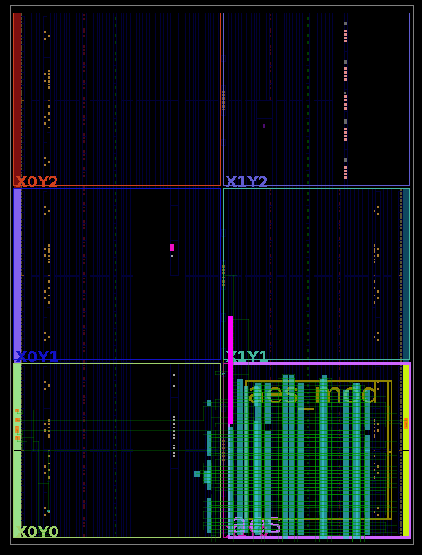

## Glitch Detector with Two Clocks and XOR Gate  

### Main Components

The main components of the given sensor, as shown in [**Fig. 1**](#fig1), include a **configurable delay line** consisting of **Carry 4 delay elements** (Artix-7), a **Mixed-Mode Clock Manager (MMCM)** module from **Xilinx Vivado**, **Two registers (flip-flops)** , and **an XOR gate** for glitch detection.

#### Fig. 1
## 

### Featured Characteristics  

The detector was implemented due to the features of the sensor, particularly its ability to **utilize two clocks** that can be configured with varying phase shifts relative to each other. The **phase shift capability of the MMCM** is leveraged for fine-tuning during the calibration phase.  

### Working Process Flow - Internal Calibration

The working process flow of the sensor, utilizing SC calibration, is as follows:

1. **Determining the Required SCs**  
   - Identify the minimum number of **short-circuits (SCs)** needed for a successful glitch.  

2. **Calibrating the Sensor**  
   - Adjust the **phase shift** between the **two clock signals** that drive the corresponding flip-flops (FFs).  
   - The output of the first FF is **inverted and fed back to the input (D)**, causing it to oscillate and **continuously apply a delayed signal** to the second FF.  

3. **Glitch Detection via XOR Gate**  
   - The outputs of both FFs are fed into an XOR gate.  
   - By **monitoring the XOR output**, we detect the presence of a glitch when an alarm signal is triggered.  

By leveraging two independent clock signals, the sensor can be **precisely calibrated** while remaining unaffected by **manufacturing variations in delay elements**.  

### Conducted Experiments - Internal Calibration

The layout of the sensor and AES module is shown in [**Fig. 2**](#fig2), and the layout of the setup with the SC array is depicted in [**Fig. 3**](#fig2). The thorough map of experiments is provided in `/Voltage_Glitch_Detectors/Test_Calibration_Map.xlsx`.

#### Fig. 2, 3
## 

  
  

## 

First of all, we started testing the sensor at the **0, 55, 50, 81 SC array** point. We found a point with **100% true positives**, with a phase shift of **-70°**. After that, we conducted several tests with the same sensitivity at a **-70° phase shift**, reducing the number of SCs to verify the required voltage glitch for breaking AES. 

Subsequently, we identified a boundary point required to break AES at the **0, 55, 50, 83 SC array** point, with **100% true positives** and a phase shift of **-85°**.

Next, we gradually decreased the sensitivity of the sensor to calibrate it, starting from the **-85° phase shift**. We determined that with a **-130° phase shift**, we no longer detected a glitch. To calibrate the sensor, we subsequently divided the range from **-130° to -85°** in half. Thus, we found that the border value was **-115°**, where glitches were still detected. 

Thus, we calibrated the sensor based on the minimum voltage required to break AES. To avoid any **false negatives** due to manufacturing effects, noise levels, or varying environments, we introduced a **5° phase shift safety margin** for the given setup.

### Detection Metrics - Internal Calibration

After conducting extensive tests, we determined: 

- **Minimum SCs for 100% successful AES glitch:** **0, 55, 50, 83 SC array**  
- **Minimum sensitivity threshold:** **115° phase shift**  

At this point, in the given conditions the detector achieved **100%** in all detection metrics: **Detection Rate**, **Precision**, **Specificity**, and **Accuracy**.

To ensure robustness against **external variations**, eliminating the possibility of **False Negatives**, we introduced a **5° safety margin**:

**-115° + 5° = -110°** - **✨ Phase Shift degrees** 

### Working Process Flow - External Calibration

The working process flow of the sensor with calibration, utilizing the ChipWhisperer-Husky, is as follows:

1. **Glitching the Target AES Module:** We first apply glitches to the AES module using the ChipWhisperer-Husky setup and determine the required voltage glitch to successfully glitch the AES module, varying the duration of the glitch and the internal voltage level of the FPGA setup.

2. **Calibrating the Sensor**  
   - Adjust the **phase shift** between the **two clock signals** that drive the corresponding flip-flops (FFs).  
   - The output of the first FF is **inverted and fed back to the input (D)**, causing it to oscillate and **continuously apply a delayed signal** to the second FF.  

3. **Glitch Detection via XOR Gate**  
   - The outputs of both FFs are fed into an XOR gate.  
   - By **monitoring the XOR output**, we detect the presence of a glitch when an alarm signal is triggered.  

By leveraging two independent clock signals, the sensor can be **precisely calibrated** while remaining unaffected by **manufacturing variations in delay elements**.  

### Conducted Experiments - External Calibration

The layout of the sensor and AES module is shown in [**Fig. 4**](#fig4). The thorough map of experiments is provided in `/Voltage_Glitch_Detectors/External_Test_Calibration_Map.xlsx`

We conducted a series of tests with different FPGA voltage levels and glitch durations required to successfully glitch the AES module, utilizing the ChipWhisperer-Husky, to assess the detector's sensitivity and performance:

#### Fig. 4
## 

  

First, we tested our setup at 0.7, 0.8, and 0.9 volts FPGA voltage levels, with glitch durations of 3 and 2 cycles, and 5 delay elements for the length of the delay line. We determined that in the given arrangement of delay line versus phase shift degrees from **-117° to -350° phase shift degrees**, we were able to identify a **100% successful glitch detection rate** in all cases. To determine the optimal values of the phase shift in the given setup, we conducted a series of experiments with a delay line length of 30 delay elements for the detector.

We identified that for a voltage level of 0.7 volts, glitches with durations of 3 and 2 cycles were successful, with an optimal corresponding phase shift of **-350° phase shift degrees**, gradually adjusting the phase shift from **-97°** to **-350°**, achieving **100% true positives**. Similarly, for a voltage level of 0.8 volts, glitches with a duration of 3 cycles were successful, with an optimal corresponding phase shift of **-97° phase shift degrees**. For a voltage level of 0.9 volts, glitches with a duration of 3 cycles were successful, with an optimal corresponding phase shift of **-350° phase shift degrees**.

To minimize the risk of **false negatives**, we introduced a **safety margin** in the phase shift.

### Detection Metrics - External Calibration

After conducting extensive tests, we determined:

- **For 0.7V:** Glitches with durations of **3 and 2 cycles** were successful, with an **optimal phase shift of -350° phase shift degrees**.
- **For 0.8V:** Glitches with a duration of **3 cycles** were successful, with an **optimal phase shift of -97° phase shift degrees**.
- **For 0.9V:** Glitches with a duration of **3 cycles** were successful, with an **optimal phase shift of -350° phase shift degrees**.

These values indicate the most effective glitch parameters for different voltage levels in our setup.

At these points, in the given conditions, the detector achieved **100%** in all detection metrics: **Detection Rate**, **Precision**, **Specificity**, and **Accuracy**.

Since the strength of the glitch capable of successfully glitching AES may fluctuate due to different mappings and manufacturing features, we maintain safe margins of **5 Phase Shift degrees**.

In our setup, we determined that for a voltage level of 0.7 volts, glitch durations of 3 and 2 clock cycles were successful, with a corresponding **-350° phase shift degrees**.

Thus, for the given setup, for **0.7V**, we set an alarm threshold at:

**-350 + 5 = -345** - **✨ Phase Shift degrees**

Subsequently, for a voltage level of 0.8 volts, only a glitch duration of 3 clock cycles was successful, with a corresponding **-97° phase shift degrees**.

Thus, for the given setup, for **0.8V**, we set an alarm threshold at:

**-97 + 5 = -92** - **✨ Phase Shift degrees**

Similarly, for a voltage level of 0.9 volts, only a glitch duration of 3 clock cycles was successful, with a corresponding **-350° phase shift degrees**.

Thus, for the given setup, for **0.9V**, we set an alarm threshold at:

**-350 + 5 = -345** - **✨ Phase Shift degrees**

### Calibration Potential

The detector's calibration strategy is based on:

- Phase shift adjustments of two clocks via the MMCM module

This precise calibration approach allows for highly accurate adjustments, making the detector adaptable to various environments while maintaining fine-tuned safety margins.

### Per-Unit Testing Evaluation

The setup shows considerable promise for **per-unit testing**, enabling the automation of every step in the **Working Process Flow**, which leads to a more efficient and streamlined chip verification process.

