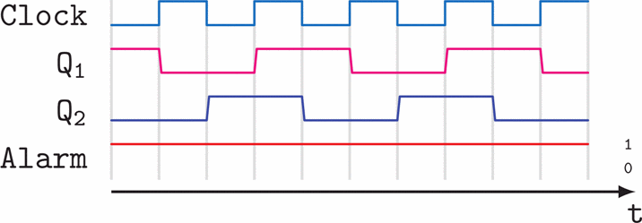

## Survey of Voltage Glitch Detectors
---------------------------------------------------------------------------------------------------------------------------------------

### Background   
---------------------------------------------------------------------------------------------------------------------------------------

Hardware fault attacks can generally be categorized into two types: physical attacks and non-physical attacks. Non-physical attacks do not require physical access to the hardware, while physical attacks involve direct tampering with or observing the hardware. Physical attacks can be further divided into active and passive attacks. Passive attacks, also known as side-channel attacks (SCA), exploit information leakage from measurable sources such as power consumption, noise, and electromagnetic waves. These leaks can provide critical insights into the cryptographic circuits. By combining this side-channel information with knowledge of cryptographic algorithms, attackers can recover secret keys, a technique widely recognized as a side-channel attack.

In our previous paper, *Investigating TDC for Hardware Security in FPGAs*, we demonstrated an example of such an SCA by employing a TDC Voltage Sensor on an Artix-7 FPGA board. These attacks do not disrupt the target device’s operations but instead rely on analyzing leaked information to extract sensitive data, such as cryptographic keys. On the other hand, active attacks aim to modify circuit behavior to create faults in its computations. These attacks physically inject faults by manipulating the operating conditions of the device, a process known as Fault Injection (FI). FI attacks are particularly dangerous as they allow attackers to disrupt the correct functioning of embedded systems, posing significant risks to critical applications.

A notable type of active side-channel attack is Differential Fault Analysis (DFA). In DFA, attackers induce faults in the circuit to produce incorrect results. By analyzing the differences between correct and faulty outputs, they may recover secret keys. Common methods for fault injection include clock glitching, voltage manipulation, and radiation-based techniques such as laser attacks. While laser attacks demand precise timing and targeting, making them less practical, clock and voltage glitching techniques are more easily controlled and present serious security threats. In our latest work, *In-Situ FPGA Fault Injection with Short-Circuits*, we implemented a fault injection attack by creating configurable short circuits (SCs) inside the FPGA, targeting the AES module. This research highlighted the dangers of such attacks, which allow attackers to interfere with the normal functioning of embedded systems, posing a severe threat to critical applications.

Several low-cost fault injection techniques are commonly used in such attacks:

#### Clock Glitching

This method involves manipulating the external clock signal by introducing one or more short pulses within the normal clock cycle. If the glitched clock period is shorter than the critical path delay, incorrect values can be latched in memory, leading to faulty circuit states. Clock glitching affects the global clock network, making it one of the simplest and most cost-effective methods of fault injection.

#### Voltage Glitching

In this attack, the voltage supplied to the target device is temporarily increased beyond its normal threshold. Power supply spikes can cause the processor to skip instructions or misread values. Like clock glitching, voltage glitching is a global fault injection method affecting the entire system.

#### Voltage Underfeeding

Another low-cost technique involves reducing the supply voltage, artificially extending the critical path delay beyond the clock period and resulting in faulty outputs. Unlike clock glitching, voltage underfeeding lacks precise timing control. A recent variation, body biasing, uses a needle to contact the IC’s silicon, modulating CMOS transistor threshold voltages.

#### Overheating

This technique exploits elevated temperatures to cause malfunctions in hardware components. Excessive heat can slow down or destabilize critical circuit elements, leading to faulty operations. Overheating, combined with other fault injection techniques, amplifies the potential for disrupting cryptographic functions.

### Inducing Fault Injection in ICs by Altering Timing Parameters
---------------------------------------------------------------------------------------------------------------------------------------

Most digital integrated circuits (ICs) operate using one or more synchronous clock signals to coordinate internal processes. Data is launched from a set of registers (referred to as the launch registers) on the rising edge of the clock, passes through combinational logic, and is finally captured by another set of registers (capture registers) on the subsequent rising clock edge. The setup time constraint governs this data transfer process and can be expressed by the following timing equation:

**Equation (1):**

`D_clk2q + D_pMax < T_clk - T_setup + T_jitter + T_skew`

In this equation, several key parameters define the setup constraint:

- **D_clk2q**: The clock-to-Q delay, representing the time required for the launch register to propagate data after the clock's rising edge.
- **D_pMax**: The maximum propagation delay through the combinational logic, also referred to as the critical path delay.
- **T_setup**: The required setup time for the capture register, which is the minimum time that input data must remain stable before the next clock edge to ensure reliable data capture.
- **T_skew**: The clock skew between the launch and capture registers.
- **T_jitter**: The timing uncertainty due to clock jitter.

A positive slack indicates that the timing constraint is met, while a negative slack signifies a timing violation. 

Timing constraint violations, particularly setup violations, are a well-known method for inducing faults in circuits. A setup violation occurs when the final transition of a signal occurs too close to the clock edge, causing the flip-flop (DFF) to exhibit metastable behavior.

### Existing Voltage Glitch Sensors
---------------------------------------------------------------------------------------------------------------------------------------

#### One FF Glitch Detector with Delay-Based Countermeasure

A widely used approach for detecting glitches in digital circuits, particularly timing violations, is a delay-based countermeasure (CM). This technique has proven effective in mitigating the effects of both clock and power supply glitches, as demonstrated by the authors [Amund Askeland, Svetla Nikova, and Ventzislav Nikov's paper](https://doi.org/10.46586/tches.v2024.i1.157-179), glitch detection circuits can be attacked through various methods.
The countermeasure primarily consists of two key components: guarding delay logic and an alarm flip-flop (FF).

The countermeasure detects a violation in the guarding delay before any actual timing violation occurs. Under normal operating conditions, the guarding delay is set to be longer than the critical path delay (`D_pMax`) but shorter than `T_clk`, satisfying:

`D_pMax < delay < T_clk`

If the supply voltage is lowered, thereby increasing the critical path delay (a method often used to induce faults), the guarding delay—being dependent on the supply voltage—will also increase. This increase will trigger a guarding delay violation, which will be detected before any timing violation occurs.

Similarly, if `T_clk` is reduced in an attempt to induce a timing violation, it must first become shorter than the guarding delay, resulting in a guarding delay violation. This mechanism allows the CM to detect clock glitches before a timing fault is introduced.

The architecture of the countermeasure, illustrated in [**Fig. 1**](#fig1), aligns with these principles. The guarding delay, implemented in circuit logic, generates a delayed clock signal (denoted `DCK`) from the original clock signal (`CK`), where `DCK(t) = CK(t - delay)`. A D flip-flop (DFF) is employed as a phase comparator, with the clock signal `CK` connected to its data input and the delayed clock `DCK` connected to its clock input.

Under normal conditions, as depicted in [**Fig. 1**](#fig1)
#### Fig. 1
## 

the output of the DFF (denoted as 'alarm') remains low. However, when a power supply glitch is introduced, the reduction in supply voltage increases the guarding delay beyond `T_clk`. As a result, the next rising edge of `DCK` latches a high value in the DFF, triggering the alarm and signaling a fault injection attempt.

It effectively protects against fault injection attacks by monitoring and comparing the guarding delay with the clock period, ensuring the timely detection of glitch-based attacks.

---

#### Counter-based Glitch Detector

The authors of [Chinmay Deshpande et al.'s study](https://doi.org/10.1109/ISVLSI.2016.123), introduced a countermeasure that monitors the incoming clock signal to ensure it operates within acceptable speeds based on the current state of the hardware. The detector compares the clock’s speed relative to the hardware’s expected behavior, identifying potential attacks. This approach uses a Ring Oscillator (RO) as the clock source, which is naturally resistant to glitches, frequency alterations, and clock manipulation faults, as it is internal to the device. The RO clock serves as a reference for comparison with the external clock, enabling precise detection of any deviations.

[**Fig. 1**](#fig1) depicts the high phase circuit. The processes are identical for both the high and low phases.

The counter is enabled during the high phase of `clkd` and increments with each positive edge of the internal RO clock (`clkro`), while the first flip-flop is enabled. The output of the counter (`cntH`) is compared to a predefined threshold value (`cntexp`), and this comparison generates the comparator output. This output is latched to `alertH` once the counter stabilizes after the negative edge of `clkd`. When `alertH` is triggered, it signals unexpected behavior in the circuit during the high phase of `clkd`. Similarly, `alertL` indicates an anomaly during the low phase. A positive edge from either `alertH` or `alertL` raises an alarm, which can lead to actions such as suspending the circuit’s operation or updating the secret key.

#### Fig. 2
## 

[**Fig. 2**](#fig2) provides a timing diagram of the system’s operation. During the high phase of `clkd`, the counter (`cntH`) increments and stabilizes at 6, which equals the expected counter value (`cntexp`) for the target `clkd` and supply voltage (`V_DD`). Since the counter value matches the expected value, no alarm is raised. However, at the end of the second high cycle, we observe that `cntH` drops to 3, causing the comparator output to remain high, as the counter value is now below the expected threshold. During the first subsequent `clkro` cycle in the low phase of `clkd`, the comparator output is latched to `alertH`, triggering the alarm.
Thus, this monitoring system effectively detects anomalies in the circuit's operating conditions and raises an alarm when necessary.

When compared to previous timing violation countermeasures, the proposed monitor offers several key advantages. First, the system is highly adaptable to varying system timing, unlike delay-based methods that rely on a fixed buffer-based delay chain, which cannot be adjusted after production. This inflexibility becomes problematic in cases of process variation and aging, where the design timing may shift from its original specification.

Secondly, it has a minimal resource footprint, with lower area and power overhead compared to traditional delay-based countermeasures. Moreover, delay sensors in traditional methods are more prone to degradation due to their higher activity, which affects their reliability and practical usability. In contrast, the solution proposed by the authors of [Chinmay Deshpande et al.'s study](https://doi.org/10.1109/ISVLSI.2016.123) remains reliable under variable conditions, as the expected values can always be recalibrated post-fabrication. Finally, the proposed monitor is entirely digital, allowing seamless integration into FPGA/ASIC designs using standard design flows.

The main drawbacks of the proposed sensor are its power consumption and the fact that its fault detection rate is less than 100%. The high-frequency RO circuit is power-hungry, leading to significant power consumption and performance inefficiency. Another common drawback of the aforementioned techniques is their less-than-perfect fault detection rate. Considering that the Advanced Encryption Standard (AES) can be broken with only two fault injections, achieving a high fault detection rate is crucial.

#### In-situ Dual-complementary EM Sensor

Low-cost fault injection techniques, such as clock glitching, voltage glitching, underfeeding, and overheating, generally impact the target device globally by temporarily violating its timing constraints. Because of this global nature, these faults can typically be detected using a single, global timing-violation detector. In contrast, the authors [Chinmay Deshpande, Bilgiday Yuce, Leyla Nazhandali, and Patrick Schaumont's paper](https://doi.org/10.1109/AsianHOST.2017.8354004)  propose that laser-based fault injection, which targets the device with highly localized laser shots, requires more precise detection mechanisms due to its localized effect.

The focus of the study is on electromagnetic fault injection (EMFI), a technique that directs high-intensity electromagnetic pulses towards a specific region of the target device using an electromagnetic probe. These pulses induce sudden currents in the power or ground networks of the device, causing transistors to switch ON or OFF unintentionally. An attacker can control the EM pulses to influence a user-defined location. Additionally, EMFI can penetrate non-metallic surfaces and is applicable even on packaged devices, eliminating the need for decapsulation. This capability makes EMFI a cost-effective and time-efficient method for injecting localized faults into a system.

The authors propose a detection architecture capable of achieving 100% fault detection with no false positives. Their novel sensing method involves pairing vulnerable flip-flops with shadow flip-flops. The shadow flip-flop is designed to behave differently from the main flip-flop under fault injection conditions. This approach leverages the sensitivity of flip-flops to voltage manipulations, allowing the detection system to monitor the relative states of the paired flip-flops and determine whether a fault injection attack is in progress.

The key components of the proposed fault detection mechanism are the core flip-flop (MF F) and an additional sensing flip-flop, termed the shadow flip-flop (SFF), as illustrated in [**Fig. 3**](#fig3)

#### Fig. 3
## 

In this detection circuit, the input to the shadow flip-flop is inverted, ensuring that under normal operating conditions, the core and shadow flip-flops capture complementary values on every clock cycle. For example, if the output of MF F is logic-0, the output of SFF will be logic-1 during the same cycle.
When subjected to fault injection, either the core or shadow flip-flop may be affected, depending on the polarity of the electromagnetic (EM) pulse. Fault detection is performed by applying an XNOR operation on the outputs of the two flip-flops. If the outputs are no longer complementary, a fault is detected. The authors highlight that this design can function as a standalone detector with minimal additional components—an extra flip-flop, a NOT gate, and an XNOR gate. Additionally, the design can utilize existing design-for-test (DFT) methodologies, such as scan chain design, to further reduce the area overhead of the fault monitor.

Figure 3 demonstrates the sensor's behavior under both fault-free and fault injection conditions.
In the first scenario, when the device is not under fault injection attack, the flip-flops' outputs alternate between complementary values with each clock cycle, keeping the alarm signal low, as expected under normal conditions.
In Figure 3b, the adversary injects a fault during the sampling window of the flip-flops, particularly around the clock's rising edge. Prior to the fault injection, the flip-flops behave as in the fault-free scenario, with complementary outputs maintaining a low alarm signal. However, during the third clock cycle, the fault causes the shadow flip-flop to change its value due to the electromagnetic fault injection (EMFI). Both flip-flops experience bit-reset faults, but since the output of MF F was already at logic-0, it remains at logic-0. The alarm signal goes high immediately, allowing the system to respond to the fault on the next clock cycle.
In the final case, the fault occurs outside of the clock sampling window, in this case inducing a bit-set fault in the circuit during the third clock cycle. The fault causes the core flip-flop's output (Q) to switch to logic-1, disrupting the complementary behavior of the flip-flops. This mismatch is quickly detected, triggering an alarm.

Unlike previous detectors, this system integrates with the circuit components that perform actual computations, leading to a significantly higher detection rate without false positives. As an all-digital implementation, the detector is seamlessly integrated into the VLSI design process for both ASIC and FPGA technologies. The system is lightweight, only requiring the addition of shadow flip-flops into the logic, and because the detector is tightly coupled with the logic, it is more difficult for an attacker to bypass. To further reduce costs, existing scan flip-flops can be repurposed as shadow flip-flops, optimizing the detector's design.

#### Standalone Timing Sensor with Delay-Based Countermeasure

The authors of [Surabhi Satyajit Gujar and Leyla Nazhandali's paper](https://doi.org/10.1007/s41635-020-00096-9) proposed the design depicted in [**Fig. 4**](#fig4) which demonstrates a timing violation detector based on a parallel delay line architecture, a commonly used design for detecting timing faults or attacks in critical paths. The core component of this design is a toggle D-flip-flop (DFF), which oscillates, switching its output with each rising clock edge. This output serves as the input for two parallel paths with different propagation delays: a short path and a long path.

#### Fig. 4
## 

The first path is a low-delay path, where the output of the toggle DFF is immediately fed into a capture flip-flop (Capture FF), resulting in minimal delay. The second path is a high-delay path, where the signal passes through a delay element (T\_delay) before reaching a dummy flip-flop (Dummy FF). The delay in the second path is intentionally designed to be significant, simulating a critical path delay.

At the end of these two paths, the outputs of the capture and dummy flip-flops are compared using an XOR gate. If the outputs match, the XOR gate produces a logic '0', indicating that no timing violations have occurred. However, if the outputs differ, the XOR gate produces a logic '1', signaling a discrepancy between the two paths.

This discrepancy could indicate a timing violation or a fault injection (FI) attack, where the signal in the longer delay path fails to propagate in time due to external interference or fault. The mismatch triggers an alarm signal, alerting the system of potential faults or attacks.

The delay of the longer path (T\_delay) is adjustable, allowing the circuit to be tuned to match the critical path delays in other parts of the system. By configuring the delay appropriately, the architecture acts as a replica circuit, where the long path replicates or slightly exceeds the critical path's delay to ensure faults or violations are detected.

This design has been widely discussed in the literature, with variations in delay tuning and path configurations used to address specific timing threats and improve fault detection sensitivity.

The authors of this study conducted extensive testing to evaluate the effectiveness of timing sensors as a countermeasure against electromagnetic fault injection (EMFI) attacks. These tests examined the impact of factors such as attack location, intensity, offset, and delay effects on detection accuracy. The results revealed both strengths and limitations of timing sensors in detecting EMFI attacks.

A key advantage of the given architecture is its minimal hardware overhead. Each sensor consists of only two flip-flops, an XOR gate, and a delay circuit, making them lightweight compared to other countermeasures. This simplicity ensures that they can be easily integrated into systems without significant resource consumption.

In addition, the detection rate of timing sensors is promising, especially when the sensor is placed near the logic vulnerable to attack. Under specific conditions, the detection rate can reach 100%, particularly at points on the chip closest to the sensor. This makes timing sensors an efficient local defense mechanism for detecting faults introduced by EMFI. Furthermore, the design independence of these sensors adds to their appeal. They can be deployed as standalone modules in any FPGA or ASIC design, protecting the device without the need for design-specific customization. This flexibility allows them to be applied across various systems to mitigate different types of FI attacks.

The performance of timing sensors is not without challenges. One significant limitation is their susceptibility to false positives, particularly when higher delay values are used to enhance detection. An increase in the delay circuit's value leads to a surge in detected faults, but it also raises the number of false positives, making the sensor less reliable. Reducing the delay to minimize false positives increases the risk of false negatives, further complicating the optimization of detection accuracy. This trade-off can result in inefficiencies such as higher energy consumption, reducing the practical effectiveness of the sensors.

Another drawback reveals itself especially during EMFI attacks: the sensitivity of timing sensors to the location and timing of such an attack. Since EMFI attacks on FPGAs are highly localized, the relationship between the glitch offset and the location of the attack plays a critical role in fault detection. While faults are typically detected around the rising edge of the clock, not all clock cycles produce faults, indicating that EM attacks are time-sensitive as well as location-specific. If a sensor is placed in a region of the chip where the clock is not propagating, it will fail to trigger an alarm, reducing its effectiveness.

Moreover, the delay-dependent nature of timing sensors introduces variability in their effectiveness. The delay circuitry that forms the basis of the sensor's detection mechanism is influenced by the fabrication process, which means the sensor must be adjusted for each specific FPGA.

Finally, the lack of visibility into the clock tree architecture in FPGAs presents a further challenge. FPGA vendors typically do not provide information about how the clock is distributed across the chip, making it difficult to optimize sensor placement for maximum fault detection. This limitation is particularly relevant as off-the-shelf FPGAs are increasingly used in products due to their low cost and flexibility. In contrast, when designing an ASIC, where the clock layout is known, it is easier to place timing sensors strategically for better EMFI detection.

In conclusion, while delay-based timing sensors offer advantages such as minimal hardware overhead, high local detection rates, and design independence, they also face significant challenges, including high false positive rates, sensitivity to attack location and timing, limited clock tree visibility, and delay dependence. These factors must be carefully considered when deploying timing sensors as a countermeasure against FI attacks in FPGA and ASIC designs.

#### Variations of Parallel Delay Line Detectors

#### Fig. 6
## 

A widely used architecture proposed by the authors [Amund Askeland, Svetla Nikova, and Ventzislav Nikov's paper](https://doi.org/10.46586/tches.v2024.i1.157-179), for timing violation detectors is the parallel delay line-based circuit, with [**Fig. 6**](#fig6) showcasing three different variations of this approach. The fundamental design consists of two parallel paths with distinct propagation delays. The key concept behind this architecture is to fine-tune the delay of one of the paths to match the expected delay of the critical path, which could be exploited by an attacker. Any successful fault injection can be identified by comparing the outputs of both paths at the end. As shown in [**Fig. 6**](#fig6), a launch D-flip-flop switches its output with each rising clock edge, effectively serving as a simple clock oscillator. This output is directed through two paths: one with a short propagation delay and the other with an intentionally long delay. The longer path, consisting of a chain of buffers, can be modified to align with the critical path delay. An XOR gate then compares the outputs of the two paths. A capture flip-flop samples the XOR gate’s result. In the event of a fault injection (FI) attack, the signal from the launch flip-flop will not fully propagate through the long delay path in time, leading the XOR gate to detect a difference between the two outputs. This mismatch triggers an alarm, signaling the detection of timing-based fault injections. The propagation delay of the long delay path, labeled $T_D$, is adjustable by adding or removing gates. This adaptability allows the detector to be tuned to match the critical path delays of different parts of the circuit. Since the long delay path is designed to closely replicate or slightly exceed the critical path of the protected circuit, it is referred to as a "replica circuit." This design has been described in several variations in the literature. For instance, in an Intel white paper, the design represented in Figure \ref{fig:sample6}a is described. Intel’s design features a configurable long delay path, allowing the alarm threshold to be adjusted to account for manufacturing variations. This adjustable delay is set during the manufacturing calibration process, and the design is known as the "Tunable Replica Circuit."

[Amund Askeland, Svetla Nikova, and Ventzislav Nikov's paper](https://doi.org/10.46586/tches.v2024.i1.157-179),
presents several circuits, one resembling the design in [**Fig. 6 c**](#fig6) and another similar to [**Fig. 6 b**](#fig6) , with the only difference being the location of the inverter.

#### Tunable Replica Circuit with 4 Muxes

The Tunable Replica Circuit (TRC) of [Kamil Gomina, Jean-Baptiste Rigaud, Philippe Gendrier, Philippe Candelier, and Assia Tria's paper](https://doi.org/10.1109/HST.2014.6855584) introduced in [**Fig. 7**](#fig7) - a new path in the design, where the combinational logic is structured as a delay tree. The detector architecture consists of oscillating flip-flops (FF), delay logic built from a series of buffers and inverters, and multiplexers arranged to form the new critical path for the circuit to protect. By adjusting the selectors, the delay can be fine-tuned post-silicon.  

#### Fig. 7
## 

The key advantage of this circuit lies in its ability to reconfigure delay, enabling compensation for unexpected variations after manufacturing. The process works as follows: when there is no attack, the outputs of FFO and FF1 are inverted. If the data at FF1 input is delayed, its output remains unchanged until the next rising clock edge, causing FFO and FF1 to become equal and triggering an alarm.

#### Critical Replica Path Detector

The authors of [Kamil Gomina, Jean-Baptiste Rigaud, Philippe Gendrier, Philippe Candelier, and Assia Tria's paper](https://doi.org/10.1109/HST.2014.6855584) proposed a novel method that is depicted in [**Fig. 8**](#fig8) - a new path with both placement and timing constraints. The core idea behind this approach is to detect timing violations on a duplicated critical path. This duplicated path includes the same startpoint and endpoint flip-flops (FFs) as the original, as well as identical logic cells. The goal is to recreate the exact path while maintaining cell fan-out as closely as possible.

#### Fig. 8
## 

To ensure the path remains active at all times, each cell's input pin is connected either to ground or to the power supply.

[**Fig. 8**](#fig8) illustrates the design architecture, showing the schematic of the critical path and its replica. An oscillating FF generates a toggling signal that propagates through the replica of the combinatorial logic, simulating the critical path. The replica must be designed to violate the timing constraints first in the event of an attack, making it crucial for its propagation delay to be slower than the original critical path. Various techniques can be used to slow down the replica path, such as inserting buffers, repeaters, or downsizing cells. In this method, a delay element is added, as it provides the simplest and most precise way to introduce the required delay and ensure proper timing margins.

#### A Fully Digital EM Detector

##### Half-Detector Architecture for EMP Susceptibility

#### Fig. 9
## 

The authors of [David El-Baze, Jean-Baptiste Rigaud, and Philippe Maurine's paper](https://doi.org/10.3850/9783981537079_0164), proposed a detector that consists of two half-detectors (HDs), as illustrated in [**Fig. 9**](#fig9). 

The architecture is designed around two oscillating flip-flops, whose outputs are fed into an XOR gate clocked by an alarm flip-flop (FF). DFF3 serves as the alarm generator by XORing the outputs \( Q_1 \) and \( Q_2 \). In normal conditions, as represented in Figure [**Fig. 10**](#fig10), the output of DFF3 remains stable at ‘1.’ DFF1, initialized at ‘1,’ toggles its output \( Q_1 \) at each rising clock edge, while DFF2, initialized at ‘0,’ switches its output \( Q_2 \) on the falling edges of the clock. As a result, \( Q_1 \) and \( Q_2 \) maintain opposite values during each clock cycle, except when an EMP occurs. This arrangement maximizes the time during which at least one of the DFFs is actively switching, enhancing the detector's susceptibility to EMPs.

When an EMP induces a fault during the switching of DFF1 or DFF2—whether during a rising or falling clock edge  [**Fig. 11**](#fig11), —the output of DFF3 transitions to '0,' raising the alarm. Additionally, faults may also occur directly within DFF3, making it another sensitive element of the half-detector.

#### Fig. 10
## 

#### Fig. 11
## 

The full detector is composed of two half-detectors to ensure full coverage of all possible transitions in the DFFs: (rising clock edge, Q rising), (rising clock edge, Q falling), (falling clock edge, Q falling), and (falling clock edge, Q rising). To achieve this, the DFFs in the two half-detectors are initialized in complementary states, as shown in [**Fig. 12**](#fig12), The full detector design ultimately features five DFFs, six inverters, two XOR gates, and one AND gate (equivalent to 34 NAND gates), which generate the sampled output signal.

#### Fig. 12
## 

This thoughtful design not only ensures heightened sensitivity to electromagnetic faults but also offers robust fault detection across a wide range of clock transitions, making it a highly effective solution for EMP susceptibility.

**Bibliography**

[1] Amund Askeland, Svetla Nikova, and Ventzislav Nikov. “Who Watches the Watchers: Attacking Glitch Detection Circuits.” In: *IACR Transactions on Cryptographic Hardware and Embedded Systems* 2024.1 (2024), pp. 157–179. [DOI link](https://doi.org/10.46586/tches.v2024.i1.157-179).

[2] David El-Baze, Jean-Baptiste Rigaud, and Philippe Maurine. “A Fully-Digital EM Pulse Detector.” In: *2016 Design, Automation & Test in Europe Conference & Exhibition (DATE)*. Mar. 2016, pp. 439–444. [DOI link](https://doi.org/10.3850/9783981537079_0164).

[3] Chinmay Deshpande, Bilgiday Yuce, Nahid Farhady Ghalaty, Dinesh Ganta, Patrick Schaumont, and Leyla Nazhandali. "A Configurable and Lightweight Timing Monitor for Fault Attack Detection." In: *2016 IEEE Computer Society Annual Symposium on VLSI (ISVLSI)*. July 2016, pp. 461–466. [DOI link](https://doi.org/10.1109/ISVLSI.2016.123).

[4] Chinmay Deshpande, Bilgiday Yuce, Leyla Nazhandali, and Patrick Schaumont. “Employing Dual-Complementary Flip-Flops to Detect EMFI Attacks.” In: *2017 Asian Hardware Oriented Security and Trust Symposium (AsianHOST)*. Oct. 2017, pp. 109–114. [DOI link](https://doi.org/10.1109/AsianHOST.2017.8354004).

[5] Kamil Gomina, Jean-Baptiste Rigaud, Philippe Gendrier, Philippe Candelier, and Assia Tria. “Power Supply Glitch Attacks: Design and Evaluation of Detection Circuits.” In: *2014 IEEE International Symposium on Hardware-Oriented Security and Trust (HOST)*. May 2014, pp. 136–141. [DOI link](https://doi.org/10.1109/HST.2014.6855584).

[6] Surabhi Satyajit Gujar and Leyla Nazhandali. “Detecting Electromagnetic Injection Attack on FPGAs Using In-situ Timing Sensors.” In: *Journal of Hardware and Systems Security* 4.3 (Sept. 2020), pp. 196–207. [DOI link](https://doi.org/10.1007/s41635-020-00096-9).
 

