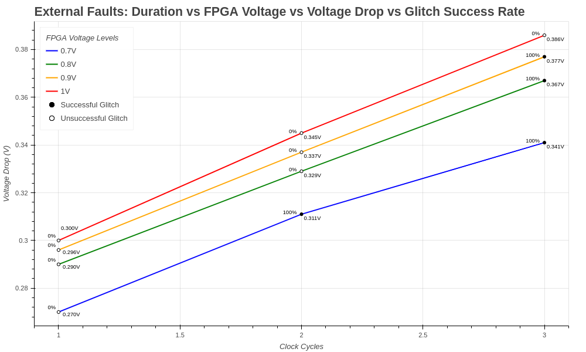
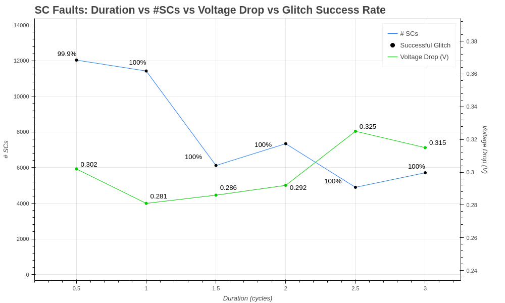

## Comparative Characterization: Short-Circuits vs. External Glitches

### External Voltage Glitches

**Setup:** ChipWhisperer Husky, CW305 FPGA, Laptop, AES module.

- **Attack Module:** The ChipWhisperer Husky is used to inject external voltage glitches into the FPGA during an AES encryption round.
- **Trigger:** The trigger mechanism is controlled through a ChipWhisperer Python script on the laptop, which adjusts the duration and intensity of the glitches and uses the 'tio4' pin as the external trigger source.
- **Measurement:** The ChipWhisperer Husky measures the voltage levels, correlating them with AES module behavior during the glitch.

#### Experimental Sequence for the External Voltage Glitch experiments is as follows:
1. Generate the bitstream file with Vivado Xilinx, containing the AES module.
2. Upload the bitstream to the CW305 FPGA using a Python script.
3. Send and receive encryption/decryption messages via the UART module.
4. Use the ChipWhisperer Python software to inject glitches and analyze the results.

In this experiment, external voltage glitches are implemented using the ChipWhisperer Husky for both glitching and measurement, with the ChipWhisperer Python software automating the glitch injection process.

#### Key Parameters Specified in the Script

#### ADC Module:
- `scope.clock.clkgen_freq = 15e6` — frequency of the external clock.
- `scope.clock.clkgen_src = 'extclk'` — external clock source.
- `scope.clock.adc_mul = 10` — ADC operates at 10 times the clock frequency, giving an effective sampling rate of 150 MHz (15 MHz × 10).
- `scope.adc.offset = 3` — adjusts the ADC offset.
- `scope.adc.basic_mode = "rising_edge"` — configures the ADC to sample data on the rising edge of the clock signal.
- `scope.trigger.triggers = "tio4"` — sets the trigger source to TIO4 (a GPIO trigger pin).
- `scope.adc.stream_mode = True` — enables ADC streaming mode.
- `scope.adc.samples = 1000000` — collects 1,000,000 samples during the capture.
- `scope.gain.db = 1` — sets the amplifier gain to 1 dB.

#### Glitch Module:
- `scope.glitch.enabled = True` — enables the glitch module.
- `scope.glitch.clk_src = "pll"` — uses clkgen for the glitch clock source.
- `scope.glitch.trigger_src = "ext_single"` — triggers the glitch externally.
- `scope.trigger.triggers = "tio4"` — uses TIO4 as the glitch trigger.
- `scope.io.glitch_hp = True` — enables the high-power transistor for glitching.
- `scope.io.glitch_lp = False` — disables the low-power transistor.
- `scope.glitch.ext_offset = 5` — specifies the offset for glitch timing relative to the external trigger.
- `scope.glitch.output = 'enable_only'` — configures the glitch output to "enable_only".
- `scope.glitch.repeat = 3` — repeats the glitch three times over consecutive clock cycles.

For power trace measurements, the ADC source clock is set to external, with the clkgen clock being a multiple of the external clock. Adjusting `adc_mul` to 10 results in an ADC sampling rate of 150 MHz.

In "enable_only" mode, the glitch signal is generated with a 100% duty cycle, considered the most effective for this setup. The glitch trigger is set to the beginning of the AES module's workflow, with an offset of 5 cycles.

### Results

The results of the experiments are documented in `../External_Glitches/_AES_External_Glitches_Map.xlsx`. The experiments were divided into four groups based on the FPGA voltage levels: 0.7V, 0.8V, 0.9V, and 1V.

The graph below shows the results of the experiments:

The results indicate that the effectiveness of external voltage glitches is directly related to the duration of the glitch, and voltage level of the target. Initially, experiments were conducted with the base voltage of 1V, but no successful glitches occurred at this voltage level. 

Subsequently, the FPGA voltage and the duration of the glitch were varied to identify the optimal glitch. At 0.9V, external glitches were successful only with a 3-cycle duration. At 0.8V, similar results were observed. At 0.7V, successful glitches occurred with 100% probability for 2 and 3 cycle durations.

### Internal Glitches Using Short-Circuits

**Setup:** CW305 FPGA, Laptop, UART interface, SC array block, AES module.

- **Attack Module:** The SC array, implemented using the RapidWrite tool, is used to induce fault injections in the AES module.
- **Trigger:** The trigger mechanism uses internal FPGA logic to induce short-circuits during AES encryption operations.
- **Measurement:** UART modules are used for sending and receiving encryption/decryption messages.

In this set of experiments, short-circuits (SCs) were implemented using an SC array on the CW305 FPGA. The bitstream was generated with Xilinx Vivado, and the SC array was implemented using the RapidWrite tool.

#### Experimental Sequence for SC Glitch experiments is as follows:

1. Generate a checkpoint file (.dcp) containing the AES module, based on the experiment type.
2. Implement the SC array in the .dcp file using the RapidWrite tool, with an `sc_enable` signal.
3. Generate the bitstream file containing the AES module and SC array.
4. Upload the bitstream to the CW305 FPGA using a Python script.
5. Send and receive encryption/decryption messages via UART.
6. Analyze the results.

### Results

The results of the SC glitch experiments are documented in `../SC_Glitches/_AES_SC_Glitches_Map.xlsx`. The experiments were divided by glitch duration, with the first set using a 1-cycle glitch.

The results are shown in the graph below:

 

The first set of experiments was conducted with SC array locations at (0, 55, 50, 65) (closest) and (0, 55, 135, 150) (farthest). These glitches were unsuccessful. Subsequently, the range of the SC array was increased, and a successful glitch was detected with a 4.2% probability at the (0, 55, 50, 108) location on the FPGA, which was marked as a reference.

After fine-tuning the SC array, the optimal setup for a successful glitch attack with 100% probability was identified for each duration of the glitch attack, ranging from 0.5 to 3 cycles, with the minimum number of SCs required.

We can observe from the graph that the general tendency of increasing voltage drop, with an increase in glitch length, is similar to external voltage glitches, but it is not linear. The minimum number of SCs required to produce a successful attack was identified at 2.5 cycles of glitch length, with an array of 4896 SCs and a voltage drop of 0.325 V.

## Key Results

1. At the FPGA Voltage Level 1V, the SC setup was able to produce successful glitches with a minimum 99.9% success rate.
2. At the FPGA Voltage Level 1V, external glitches were not able to produce successful glitches with any setup or duration of the glitch.
3. At 1 cycle duration, external voltage glitches were unsuccessful at all voltage levels (0.7V, 0.8V, 0.9V, 1V).
4. At all fault attack lengths (0.5, 1, 1.5, 2, 2.5, and 3 cycles), a successful SC glitch setup was identified.

## Detection Metrics

- **Percentage of Successful Faults:** 
  #### SC glitches: 
  - 99.9% successful at 0.5-cycle length
  - 100% successful at all other lengths with optimal array sizing.
  #### External glitches:
  - 0% successful at 1V for all lengths, 0.9V for 1 and 2 cycle lengths, 0.8V for 1 and 2 cycle lengths, and 0.7V for 1 cycle length. 
  - 100% successful at 0.9V and 0.8V for 3 cycle lengths; at 0.7V for 2 and 3 cycle lengths.

- **Repeatability:** 
  Both setups with optimal parameters produced consistent results.

- **Control and Precision:** 
  The SC array block demonstrated great manageability. Using the RapidWrite tool, it was possible to implement glitches with varying array sizes. The Verilog HDL allowed fine-tuning of the block's trigger parameters. Additional experiments were conducted with an SC array control block, enabling fine-tuning of the glitch duration using the Xilinx MMCM clock manager.

  External glitch control was managed via the ChipWhisperer Python script. The "glitch_only" mode did not produce successful glitches. Therefore, the "enable_only" mode was used, allowing successful glitches at 2 and 3 clock cycle lengths.

- **Glitch Strength Comparison:**
  The SC array demonstrated a significantly higher glitch strength compared to external glitches. SC glitches successfully disrupted AES with 0.5-cycle durations, while external glitches required a minimum of 2 cycles. This suggests that SC array glitches have greater potential, especially when a strong glitch is required.

