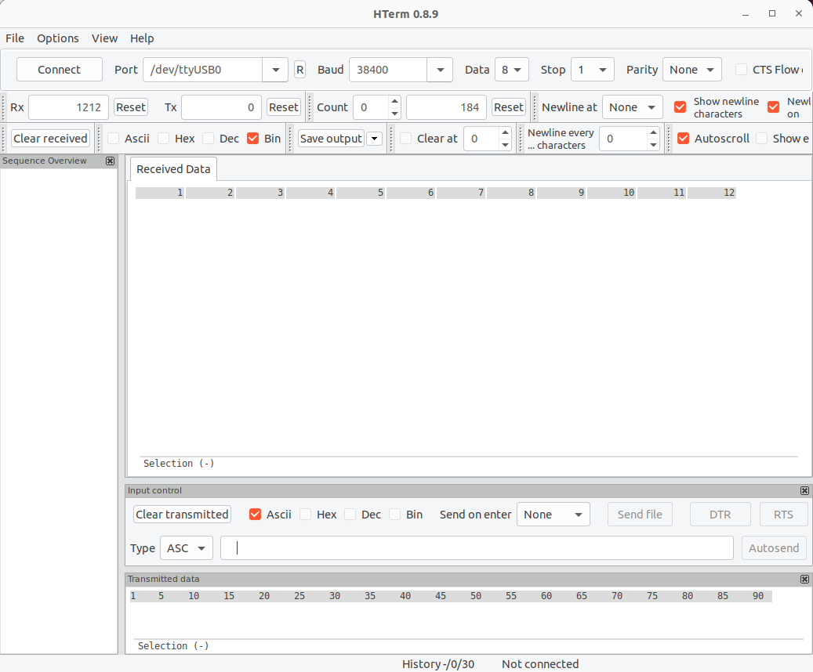
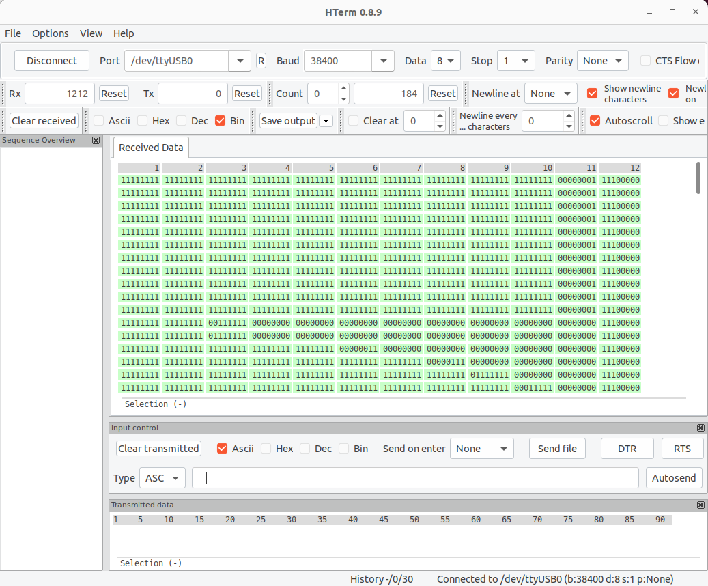

### Sensor/SC Bitstream File Generation and Final Data Retrieval

#### Steps:

1. **Download RapidWright**:  
   [https://www.rapidwright.io/docs/Getting_Started.html] 

2. **Install SC Repository**:  
   Clone the repository from:  
   [https://github.com/byuccl/short_circuit_aging/tree/956cba88222e0dbd7396862589ee49f78d6cec12]
3. **Run the `RapidWrite_SC_.java` Script**:  
   Look for: `characterizing_SCs_using_TDC/_Example_WorkFlow_TDC_SC/scripts_
/RapidWrite_SC_.java`

4. **Open Generated `.dcp` File in Vivado**:  
   Use Vivado to load the output `.dcp` file.

5. **Open ECO Flow and Route Design in Vivado**:  
   Navigate to the ECO flow and route the design.

6. **Disable DRC Checks for SCs**:  
   Run the following command in the Vivado Tcl Console:  
   ```tcl
   set_property SEVERITY {Warning} [get_drc_checks]
7. **Generate the Bitstream File**:  
   In Vivado, finalize the process by generating the bitstream file from the routed design.
   
8. **Connect CW305 to Laptop**:  
   1. **USB B**: Connect the USB B port of the CW305 to your laptop (to upload the bitstream file).  
   2. **UART Communication**: Use a USB-to-UART adapter and connect the following pins:  
      - `GND` → `GND`  
      - `IO1` → `TXD`  
      - `IO2` → `RXD`  

9. **Set Up HTerm**:  
   [https://www.der-hammer.info/pages/terminal.html]

10. **Configure the Desired Interface, Baud Rate and Connect the FPGA**:
    - Select the appropriate output interface.
    - Set the baud rate to **38400** for the current setup.
    - Click the "Connect" button in the top-left corner.
      

11. **Start the Design**:  
    - Press the **R1 pushbutton** on the CW305 board to start the design.  
    - *Note: Currently, we use the pushbutton as a hardware trigger. In the future, external instruments could be used to trigger the design, avoiding the complexity of sending UART messages.*

12. **Retrieve the Data**:  
    - Retrieve the data for further analysis. 
      


